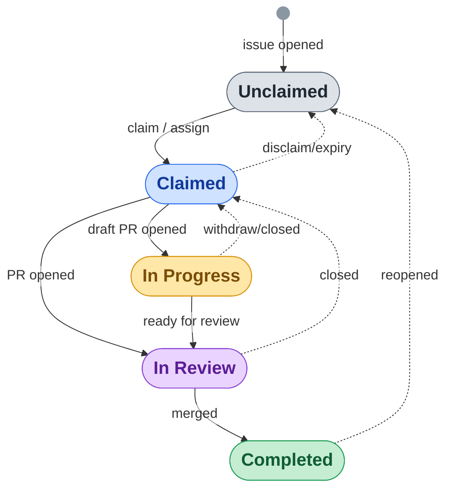

# intentions

Coordinate who works on what. Contributors **claim** tasks by commenting on GitHub issues;
the bot assigns them and moves a card on a Projects v2 board. Claims can carry a
configurable **expiry (TTL)**, so abandoned work is released automatically instead of
blocking everyone forever.

It's up to individual projects to interpret these claims: some may treat them as
merely informational while other may expect that they are carefully respected.

This is a reusable GitHub Action. Projects install it with a **single small workflow file**
described below — there are no GitHub native Project workflows to configure by hand.

## How it works

Comment on an issue that's on the project board:

| Comment | Effect |
|---|---|
| `claim` | Claim the task with the project's default TTL. |
| `claim 2w` · `claim 5 hours` · `claim 2026-08-01` | Claim with a custom expiry (duration or date). |
| `claim …` (again, as the holder) | Renew / extend your claim. |
| `claim` + following lines | Attach a freeform note (see below). |
| `assign @bob` · `assign @bob 2w` | Register **someone else** on the task (see below). |
| `disclaim` | Release a task you hold. |
| `propose PR #123` | Link your PR; move the task to *In Progress* (refreshes the TTL). |
| `withdraw PR #123` | Move back to *Claimed* (you keep the claim). |

Durations are parsed flexibly: `1h`, `1 hr`, `5 hours`, `7d`, `7 days`, `2wks`, `3 weeks`,
`2 mths`, `3 months` (a month = 30 days). Dates are `YYYY-MM-DD` or full ISO 8601. The bot
always tells you the effective expiry, and rejects requests over the project maximum with a
helpful message.

The board's `Status` field moves `Unclaimed → Claimed → In Progress`, and a scheduled
**sweep** returns expired claims to `Unclaimed`.

### Assigning someone else

`claim` is self-service: anyone can take an unclaimed task. `assign @bob` is its maintainer-facing
counterpart — it registers *someone else* on a task. Because directing another person's work is an
act of authority, only commenters with **write or triage** access to the repo may use it; everyone
else is told to `claim` it themselves. The target must be assignable (a collaborator, or an org
member with read access).

Unlike `claim`, `assign` **overrides an existing claim**: handing off abandoned or misallocated work
is the main reason to use it, so the previous holder is replaced. It otherwise behaves exactly like
`claim` — same expiry grammar (`assign @bob 2w`, `assign @bob 2026-08-01`), the same default and
maximum TTL, and the same freeform note on following lines. The assignee can then renew with `claim`,
or step back with `disclaim`. The bot's confirmation is addressed to the assignee, for example:

> @bob, @alice has registered you as working on this task. This registration expires **Aug 1, 2026**.

### Claim notes

The first line of a `claim` comment is the command (and optional expiry); everything on the
following lines is scraped verbatim into a freeform **note** and stored on the board's
`Claim Note` Text field. For example:

```
claim 2w
Splitting this into three PRs; starting with the parser.
```

records a two-week claim with the note "Splitting this into three PRs; starting with the
parser." The note is updated whenever the holder re-claims with new text, and cleared when the
claim is released (disclaimed or expired). It's a pure convenience: if your board has no
`Claim Note` field, notes are silently ignored (rename it with `note-field`). Notes longer than
1024 characters are truncated.

### Automatic board lifecycle

Beyond the comment commands, the bot keeps the whole board in sync from issue and PR events,
so you don't have to wire up GitHub's native Project automations:

| Event | Effect |
|---|---|
| Issue opened | Added to the board as *Unclaimed* (`auto-add`, on by default). With `claim-on-open`, auto-claimed for the issue author, reading the expiry from the issue form — so registering needs only the form, no `claim` comment. |
| PR opened linking the issue (`Closes #123`) | Claims it for the PR author if unclaimed, then moves to *In Review* (or *In Progress* while the PR is a draft) and refreshes the TTL. |
| PR merged | Task → *Completed*. |
| PR closed without merging | Task → *Claimed* (the claim is kept). |
| Issue closed | Task → *Completed*. |
| Issue reopened | Task → *Unclaimed* (only if it was *Completed*). |

The PR linkage is read from GitHub's parsed `Closes #N` / `Fixes #N` references, so a
contributor who opens a linked PR never has to type `propose`. Every transition is guarded on
the card's current status, so manual board edits aren't overwritten. *In Review* and
*Completed* are skipped automatically if your board has no such option.

### The board as a state machine

Each issue is one task, and its `Status` column is the state. Solid edges are the forward
path; dotted edges return a task to an earlier column. Every edge can be driven by either a
**comment command** or an **automatic event** — the two tables above spell out which — so a
project can run on comments, on PR events, or any mix.



Closing an issue moves it straight to *Completed* from any column. The column names are the
defaults; rename them with the `status-*` inputs. This adapts Figure 7 of the
[Equational Theories Project paper](https://arxiv.org/abs/2412.07067), where Pietro Monticone
and Shreyas Srinivas first drew this flow — extended here with the expiry sweep, auto-add, and
the automatic PR-driven edges.

## Adoption

A three-step recipe. (To adopt without any expiry behavior, see step 2's note — you can skip
the `Claim Expires` field and drop the `schedule` trigger entirely.)

### 1. Set up the board

On your **Projects v2** board, make sure you have:

- a **single-select** field `Status` with options `Unclaimed`, `Claimed`, `In Progress`
  (add `In Review` / `Completed` too to get the full PR-driven lifecycle — they're optional
  and skipped if absent);
- a **Text** field `Claim Expires` (the bot stores each claim's expiry here as an ISO 8601
  UTC datetime). *Skip this if you set `default-ttl: none`.*
- *(optional)* a **Text** field `Claim Note` to hold the freeform note scraped from `claim`
  comments. *Skip it and notes are silently ignored.*

Add issues to the board and set their `Status` to `Unclaimed` — those are the claimable tasks.

### 2. Authenticate (~5 minutes)

The bot needs to read/write the project and assign/comment on issues. The default
`GITHUB_TOKEN` **cannot** write org Projects v2, so you give it one of these. Pick **A** for
a clean `…[bot]` identity, or **B** if you just want something quick.

#### A. GitHub App (recommended)

1. **One click:** open **<https://leanprover-community.github.io/intentions/create-app.html>**,
   enter your org, and create the App — permissions and webhook-off are pre-filled for you.
2. On the new App: **generate a private key** (`.pem`), note the **App ID**, and **install**
   it on the repo with your issues.
3. In that repo → Settings → Secrets and variables → Actions, add:
   - variable **`INTENTIONS_BOT_APP_ID`** = the App ID,
   - secret **`INTENTIONS_BOT_APP_PRIVATE_KEY`** = the `.pem` contents.

#### B. Fine-grained PAT

Create a fine-grained PAT with **Projects: R/W** (for an org-owned board the Projects permission
is under *Organization permissions*, and the token's resource owner must be that org). Add it as
secret **`INTENTIONS_BOT_TOKEN`**, and in the workflows below pass
`project-token: ${{ secrets.INTENTIONS_BOT_TOKEN }}` instead of the `app-id` / `app-private-key`
lines. The PAT needs **only** Projects access: the reusable workflow assigns issues and edits PRs
with the repo's own `GITHUB_TOKEN` (passed as `repo-token`). If you instead call the action
directly without a `repo-token`, the PAT also needs **Issues: R/W** and **Pull requests: R/W**.

<details><summary>Setting up the App by hand instead of the one-click form</summary>

Org → **Settings → Developer settings → GitHub Apps → New** — webhook **off**;
**Repository permissions:** Issues R/W, Pull requests R/W; **Organization permissions:**
Projects R/W (or *Account permissions → Projects* for a user-owned board). Then install,
generate a key, and set the variable/secret as in step 3 above.
</details>

See [examples/board-setup.md](examples/board-setup.md) for full details.

### 3. Add the workflow

Create a single `.github/workflows/intentions.yml` (full copy in
[examples/caller-intentions.yml](examples/caller-intentions.yml)):

```yaml
name: Intentions
on:
  issue_comment:
    types: [created]
  issues:
    types: [opened, closed, reopened]
  pull_request_target:
    types: [opened, reopened, ready_for_review, converted_to_draft, closed]
  schedule:
    - cron: "17 */6 * * *"   # the sweep; tighter (e.g. "*/15 * * * *") if you use short TTLs
  workflow_dispatch: {}
jobs:
  intentions:
    uses: leanprover-community/intentions/.github/workflows/intentions.yml@v1
    with:
      project-title: "My Project"   # exact title of your Projects v2 board
      default-ttl: "30d"            # use "none" to disable expiry entirely
      max-ttl: "90d"
      app-id: ${{ vars.INTENTIONS_BOT_APP_ID }}
    secrets:
      app-private-key: ${{ secrets.INTENTIONS_BOT_APP_PRIVATE_KEY }}
```

One workflow handles comments, the issue/PR lifecycle, and the sweep — the reusable workflow
picks the right job from the triggering event. If you set `default-ttl: none`, drop the
`schedule` trigger (the sweep then does nothing). To turn off the automatic lifecycle and keep
only the comment commands, list just the `issue_comment` trigger.

That's it. Contributors now claim tasks by commenting `claim`, or simply by opening a PR that
closes the issue.

## Expiry: defaults, limits, and opting out

- `default-ttl` (default `30d`) — applied to a bare `claim`.
- `max-ttl` (default `90d`) — the longest a claimant may request.
- **Opt out entirely:** set `default-ttl: none`. The bot then never records or mentions
  expiry, the sweep is a no-op, and you don't need the `Claim Expires` field or the `schedule`
  trigger. (You still get the commands and the board lifecycle.)

> **Sub-day TTLs are best-effort.** GitHub's `cron` fires loosely (often delayed many
> minutes), so a `1h` claim is released at *next sweep ≥ expiry*, not on the minute. If you
> rely on short TTLs, run the sweep more often (e.g. `*/15 * * * *`). An explicit `disclaim`
> always releases immediately.

## Configuration

All inputs (set on the reusable workflow):

| input | default | meaning |
|---|---|---|
| `project-title` | — (required) | exact title of the Projects v2 board |
| `repo-token` | the job `GITHUB_TOKEN` | token for Issue/PR writes; the reusable workflow sets it so `project-token` only needs Projects access |
| `default-ttl` | `30d` | TTL for a bare `claim`; `none`/`off` disables expiry |
| `max-ttl` | `90d` | maximum requestable TTL |
| `status-field` | `Status` | single-select field name |
| `status-unclaimed` / `status-claimed` / `status-in-progress` | `Unclaimed` / `Claimed` / `In Progress` | option names |
| `status-in-review` / `status-completed` | `In Review` / `Completed` | lifecycle targets when a PR is ready / merges; skipped if the board lacks the option |
| `auto-add` | `true` | add newly opened issues to the board as *Unclaimed* |
| `auto-add-labels` | `` (all) | comma-separated label allowlist for auto-add; if set, only opened issues carrying one of these labels are added (e.g. `intention`) |
| `claim-on-open` | `false` | auto-claim a newly opened (auto-added) issue for its author, so registering needs only the issue form and no separate `claim` comment |
| `claim-expiry-field` | `` | issue-form field label to read the auto-claim expiry from (e.g. `Credible expiry date`); empty/missing/unparseable falls back to `default-ttl`. Only used when `claim-on-open` is set |
| `terminal-statuses` | `In Review,Completed` | states where a `claim` comment is refused |
| `expiry-field` | `Claim Expires` | Text field holding the ISO 8601 UTC expiry |
| `note-field` | `Claim Note` | optional Text field holding the freeform claim note; ignored if absent |
| `expire-in-progress` | `false` | also expire *In Progress* items in the sweep |
| `backfill-legacy` | `grace` | how the sweep treats claims with no expiry: `grace` / `ignore` / `expire` |

## Migrating from the original four-file bot

Replace the per-project `01-claim-issue.yml` … `04-withdraw-pr.yml` with the single workflow
above (one PR). The command vocabulary is unchanged, so contributors notice nothing except
that claims now expire. To preserve the old "claims never expire" behavior, set
`default-ttl: none`. Existing open claims (which have no recorded expiry) are handled by
`backfill-legacy` — the default `grace` gives them `now + default-ttl` on first sweep rather
than expiring them immediately.

The bot assumes a **single assignee per claim** (the claimant). On expiry the sweep clears
the assignee; don't co-assign maintainers to claim-managed issues, or set the expiry on the
board directly to override.

## Development

```bash
npm install
npm run typecheck && npm run lint && npm run test
npm run build        # compiles src/ into the committed dist/ via @vercel/ncc
```

The action runs from `dist/`, which is **committed**. CI fails if `dist/` is out of date, so
always `npm run build` and commit the result with any source change. Contributions welcome.

## Credits

This bot is a reimplementation of the claim/dashboard workflow
originally designed and built by **[Pietro Monticone](https://github.com/pitmonticone)** and
**[Shreyas Srinivas](https://github.com/Shreyas4991)** for the
[Equational Theories Project](https://github.com/teorth/equational_theories), and
subsequently deployed by Pietro to
[FLT](https://github.com/ImperialCollegeLondon/FLT),
[PrimeNumberTheorem+](https://github.com/AlexKontorovich/PrimeNumberTheoremAnd), and
[∞-Cosmos](https://github.com/emilyriehl/infinity-cosmos). The `claim` / `disclaim` /
`propose PR` / `withdraw PR` vocabulary and the board-driven workflow are theirs; this repo
repackages that idea as a maintained, reusable action and adds claim expiry. Thank you both.

The same workflow has since been adopted by other Lean/math projects, including
[Sphere Packing in Lean](https://github.com/thefundamentaltheor3m/Sphere-Packing-Lean),
[ABC-Exceptions](https://github.com/b-mehta/ABC-Exceptions),
[SpectralThm](https://github.com/oliver-butterley/SpectralThm), and
[brownian-motion](https://github.com/RemyDegenne/brownian-motion).

## License

Apache-2.0.
